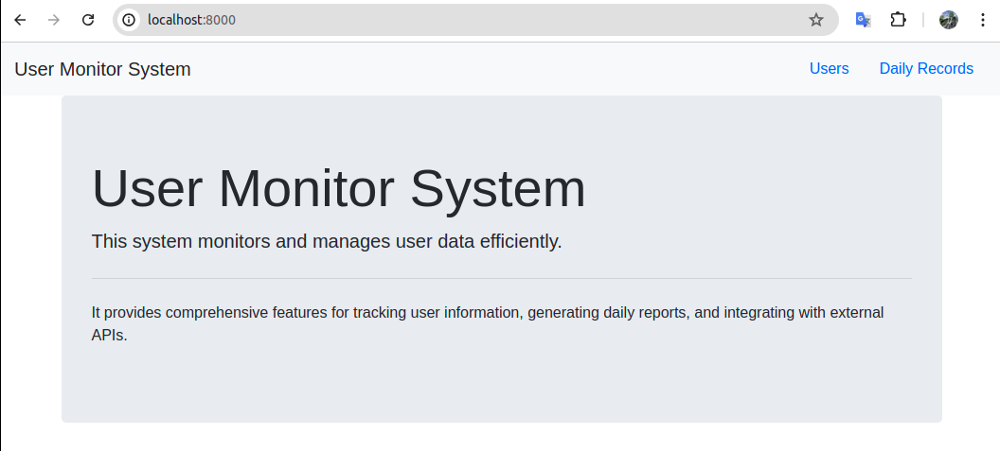
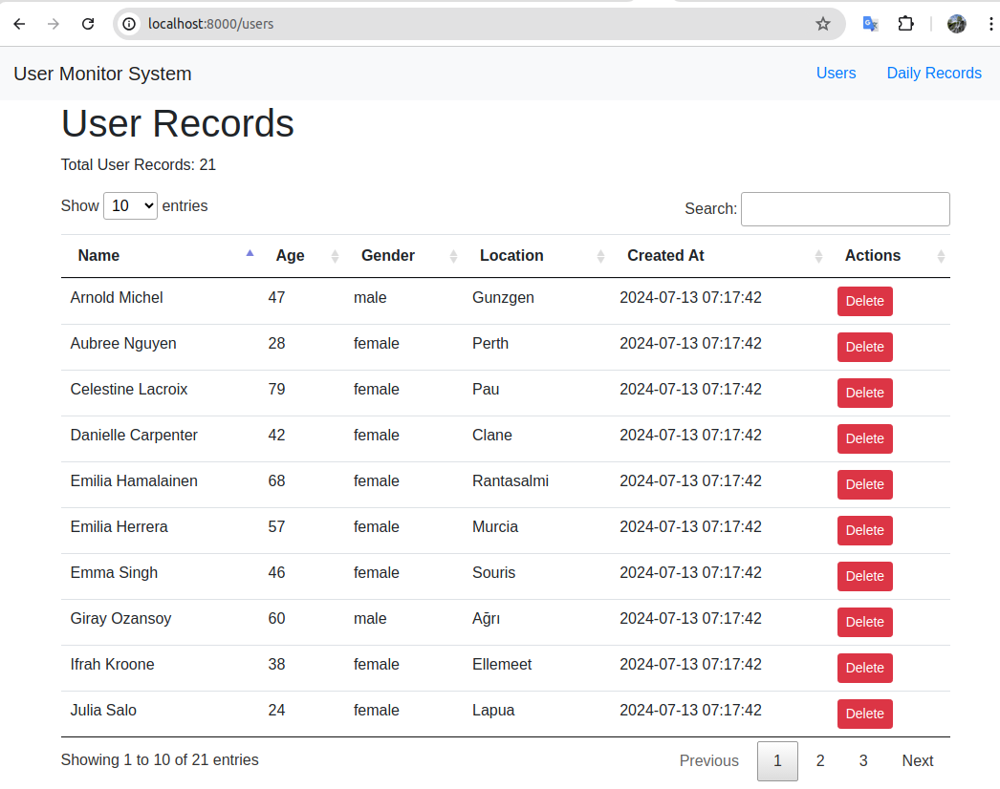
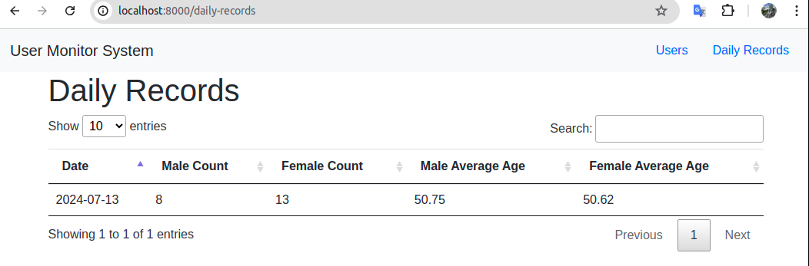

# User Monitor System

## Overview

User Monitor System is developed using Laravel 11 on Ubuntu Linux. It includes two main pages: User Page and Daily Records Page. Additionally, it features a cron job for fetching users and a job for calculating average user age and gender counts.

## Pages

- **Home Page**: Home page.
  - URL : [http://localhost:8000]
  

- **User Page**: Displays a list of users.
  - URL: [http://localhost:8000/users](http://localhost:8000/users)
  

- **Daily Records Page**: Shows daily records.
  - URL: [http://localhost:8000/daily-records](http://localhost:8000/daily-records)
  

## Cron Job

- **Fetch Users**: Implemented in `App\Console\Commands\FetchUsers.php`.
  - Fetches users from an external API and updates the database.
  - Scheduled to run hourly.

## Job

- **Daily Summary**: Handled by `App\Jobs\DailySummaryJob.php`.
  - Calculates average user age and counts male/female users daily.
  - Scheduled to run daily at 23:59.

## Schedule Configuration

Located in `routes/console.php`:

```php
use Illuminate\Support\Facades\Artisan;
use Illuminate\Support\Facades\Schedule;

use App\Jobs\FetchUsersJob;
use App\Jobs\DailySummaryJob;

Artisan::command('daily:summary', function () {
    DailySummaryJob::dispatch();
})->purpose('Generate daily summary');

Schedule::command('fetch:users')->hourly();
Schedule::command('daily:summary')->dailyAt('23:59');
```

## Running the Application

### Start Laravel Development Server:

1. Open your terminal, navigate to your project directory, and configure Redis and the database in your `.env` file based on `.env.example`.

2. Migrate your Laravel application to create necessary tables:
  
    ```bash
    php artisan migrate
    ```
2. Run the following command to start the Laravel development server:

    ```bash
    php artisan serve
    ```

3. This will start the server at [http://localhost:8000](http://localhost:8000).

### Start Laravel Queue Worker:

1. Open a new terminal window or tab.
2. Navigate to your project directory.
3. Run the following command to start the Laravel queue worker, which processes jobs like `DailySummaryJob`:

    ```bash
    php artisan queue:work
    ```

4. Ensure the queue worker is running continuously to process queued jobs.

### Set Up Scheduler (Optional):

1. If you want to automate tasks like fetching users and generating daily summaries, set up the Laravel scheduler with cron:
   
   - Open your terminal.
   - Navigate to your project directory.
   - Edit your crontab file:

     ```bash
     crontab -e
     ```

   - Add the following line to run Laravel scheduler every minute (adjust paths as necessary):

     ```bash
     * * * * * cd /path-to-your-project && php artisan schedule:run >> /dev/null 2>&1
     ```

   - Save and exit the crontab editor.

### Notes:

- Ensure you have PHP installed on your system and configured properly.
- Replace `/path-to-your-project` with the actual path to your Laravel project directory.
- Running the queue worker (`php artisan queue:work`) is essential for processing background jobs.
- The scheduler (`php artisan schedule:run`) ensures tasks scheduled in your Laravel application are executed automatically.